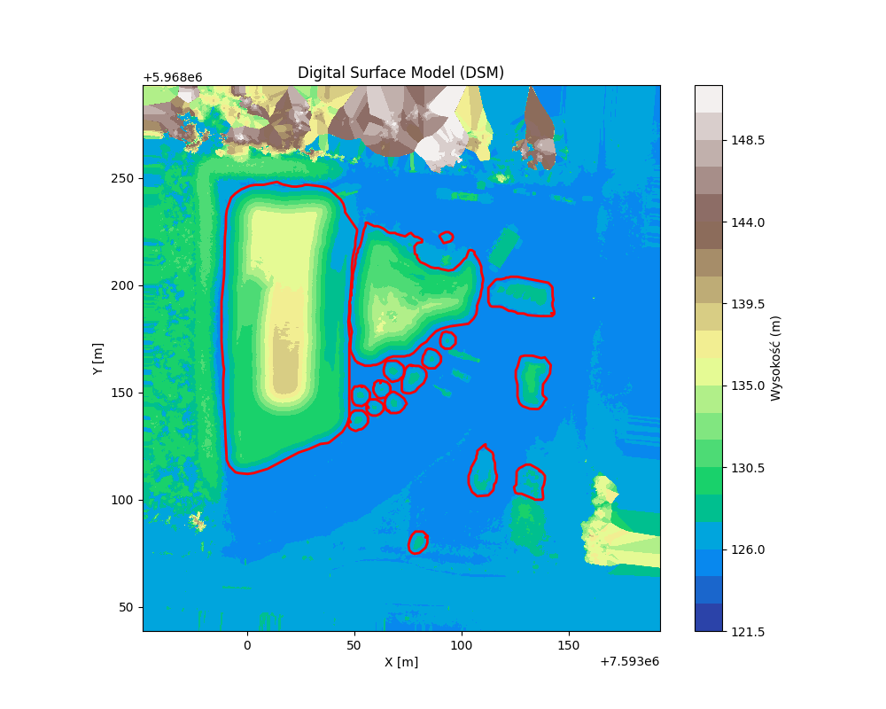
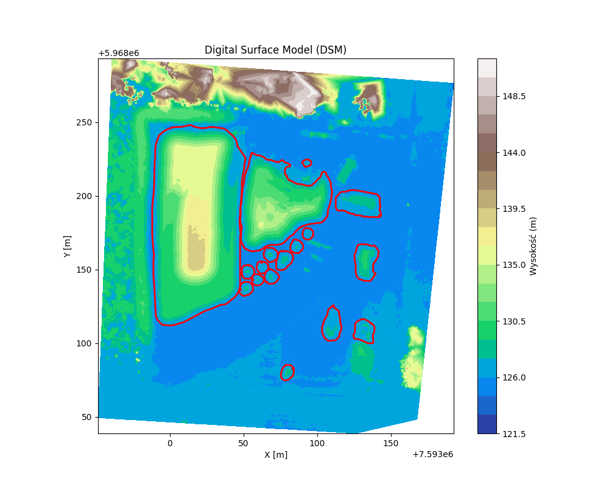

# Analiza objętości hałd na podstawie chmury punktów

## Metodyka obliczania objętości
1. Konwersja chmury punktów do rastra wysokościowego (*las_utils.las2dsm*)

    Dostępne dwie opcje interpolacji: Nearest Neighbour - szybsza (po lewej) oraz TIN - wolniejsza, ale dokładniejsza (po prawej)

|  |  |
|-----------------|-----------------|

2. Wyznaczanie statystyk dla każdego poligonu
-  objętości względem powierzchni bazowej - średniej wysokości z NMPT obliczona dla obrysu poligonu
    - *analysis.calculate_volume*
-  powierzchni 3D - suma powierzchni trójkątów z triangulacji Delaunaya na podstawie punktów chmury
    - *analysis.calculate_area_from_point_cloud*
-  powierzchnie pokrycia poligonu punktami - zlicza liczbę punktów (z chmury) wewnątrz poligonu i wyznacza powierzchnię jako stosunek liczby punktów znajdujących się wewnątrz poligonu do całkowitej liczby punktów w chmurze
    - *analysis.calculate_coverage_area*
3. Ekstrakcja i zapis obrysów hałd wygenerowanych algorytmem alpha shape na podstawie punktów dla kolejnych pred_ID
    - *contour.alpha_shape*

Przykładowe wyniki zapisane w **data/RESULTS**

## Uruchomienie
Kod pisano w Python:3.13.2. Rekomendowane utworzenie wirtualnego środowiska Python. Instalacja wymaganych bibliotek: \
`pip install requirements.txt` \
Uruchomienie skryptu main.py: 
`python .\src\main.py`

**Podczas uruchamiania zwróć uwagę na ścieżki danych wejściowych. Konieczne jest również wrzucenie chmury punktów (nie została uwzględniona w repo ze względu na duży rozmiar).**

## Testy
Testy dostępne w folderze *tests*. Uruchomienie testów za pomocą:\
`pytest test/`\
Do testów generowana jest chmura punktów w kształcie piramidy w celu wyznaczenia jej wzorcowej objętości/pola powierzchni i porównania ich z wynikami funkcji *analysis.calculate_volume* i *calculate_area_from_point_cloud*. Dla testowania wyznaczania objętości wykorzystano dynamiczną tolerancję na podstawie zróżnicowania wysokości w NMPT.
